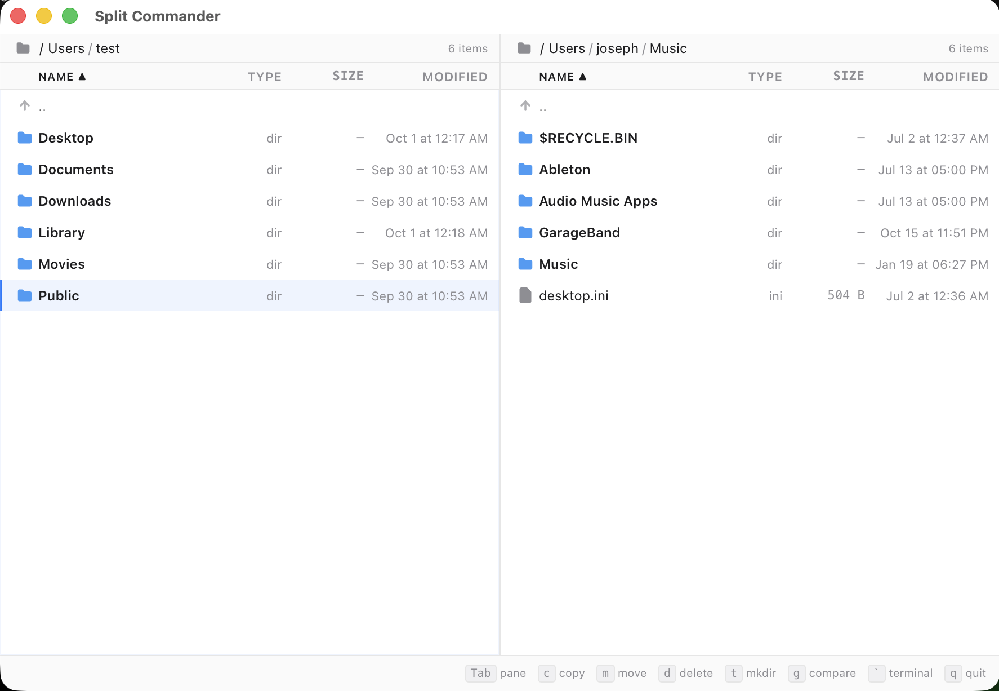

# SplitCommander

A keyboard-first, two-pane file manager for macOS with directory comparison. Built with Tauri v2 (Rust) and Svelte 5 (TypeScript).



## Features

- **Dual-pane file browser** — navigate two directories side by side with keyboard or mouse
- **Directory comparison** — diff two directories by structure (presence + type) or smart mode (presence + type + size + mtime)
- **Color-coded diffs** — instantly see what's identical, left-only, right-only, modified, or mismatched
- **Built-in terminal** — dual-pane terminal panel that follows your current directory
- **Fast** — parallel scanning with jwalk, virtual scrolling for 200k+ file lists
- **Dark & light themes** — follows your system preference
- **Read-only by design** — comparison only, no accidental writes


## Install

### Prerequisites

- [Node.js](https://nodejs.org/) 18+
- [Rust](https://rustup.rs/) (stable)
- Xcode Command Line Tools (`xcode-select --install`)

### Build from source

```bash
git clone https://github.com/webdevbyjoss/SplitCommander.git
cd SplitCommander
npm install
npm run tauri build
```

The built `.app` bundle will be in `src-tauri/target/release/bundle/macos/`.

### Development

```bash
npm run tauri dev
```

## Usage

SplitCommander is keyboard-driven. The footer bar shows available commands for the current screen.

### Browse mode

| Key | Action |
|-----|--------|
| `Tab` | Switch pane |
| `Up/Down` | Navigate files |
| `Enter` | Open file or enter directory |
| `Backspace` | Go up one level |
| `i` | Toggle hidden files |
| `t` | Create directory |
| `g` | Compare directories |
| `` ` `` | Toggle terminal |
| `q` | Quit |

### Compare mode

| Key | Action |
|-----|--------|
| `Up/Down` | Navigate diffs |
| `Enter` | Drill into subdirectory |
| `Backspace` | Go up one level |
| `s` | Toggle identical files |
| `Esc` | Back to browse |
| `q` | Quit |

### Terminal

| Key | Action |
|-----|--------|
| `Tab` | Switch terminal pane |
| `Esc Esc` | Close terminal |

## Architecture

Tauri v2 two-process model:

- **Rust backend** (`src-tauri/src/`) — filesystem scanning, comparison engine, PTY management, JSON export
- **Svelte 5 frontend** (`src/`) — UI rendering, state management with runes, virtual scrolling

### Comparison pipeline

1. **Scan** — parallel directory walk with [jwalk](https://crates.io/crates/jwalk), progress events streamed to UI
2. **Compare** — classify diffs (Same, OnlyLeft, OnlyRight, MetaDiff, TypeMismatch)
3. **Deep verify** — BLAKE3 content hashing (planned)

### Key crates

`tauri 2` | `jwalk` | `serde` | `chrono` | `tokio` | `portable-pty` | `thiserror`

## Testing

```bash
# Rust tests (40 tests covering scanner, comparator, ignore rules, security, export)
cd src-tauri && cargo test

# Type-check frontend
npm run check
```

## Contributing

Contributions welcome. Please open an issue first to discuss what you'd like to change.

## License

[MIT](LICENSE)
